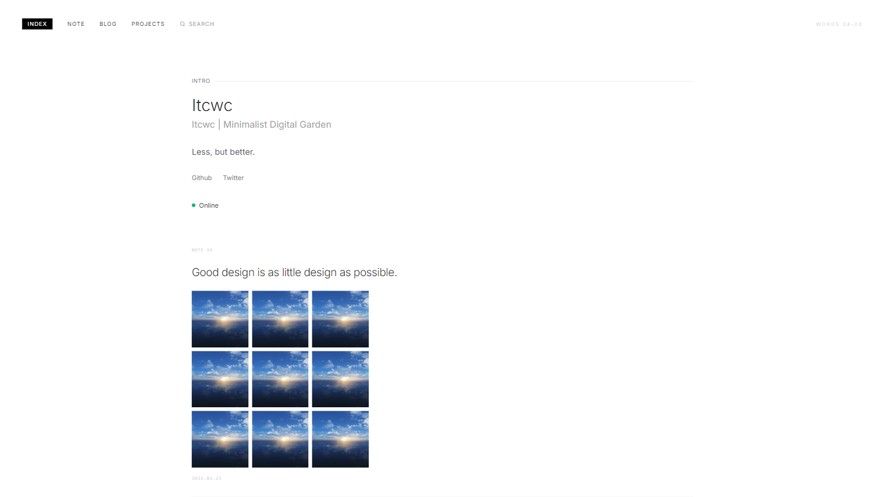
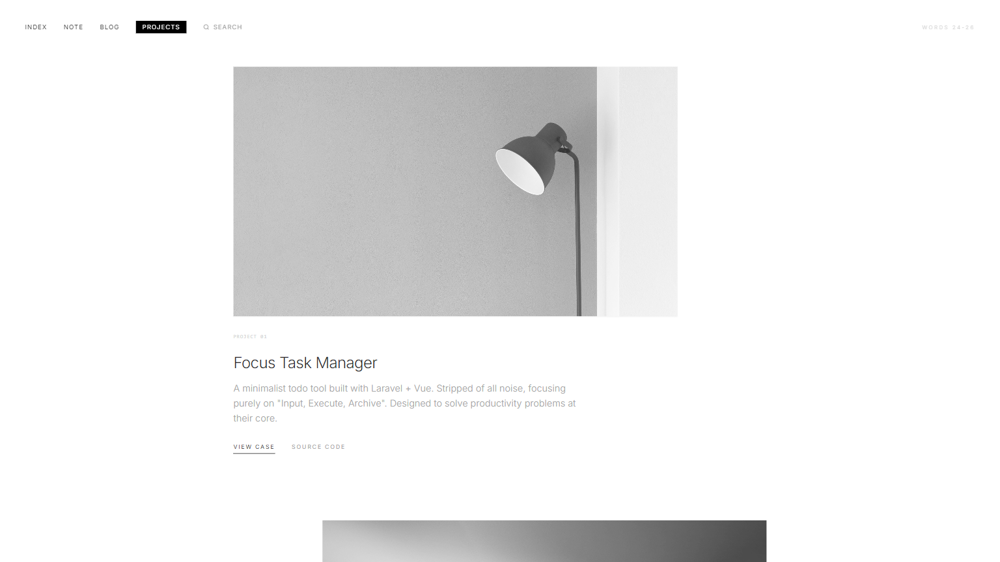
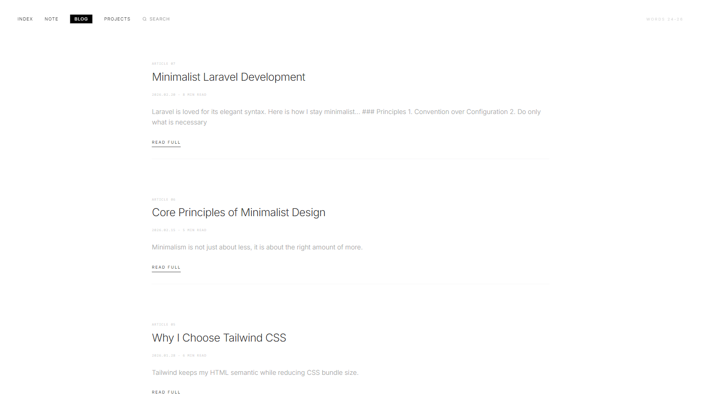
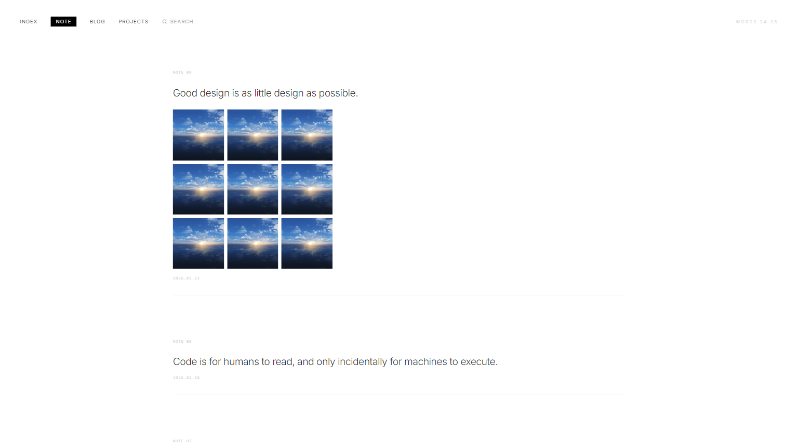
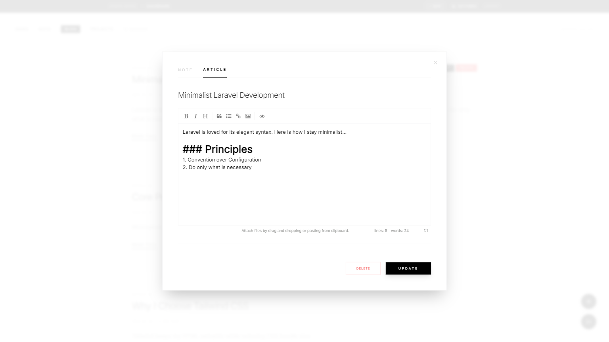
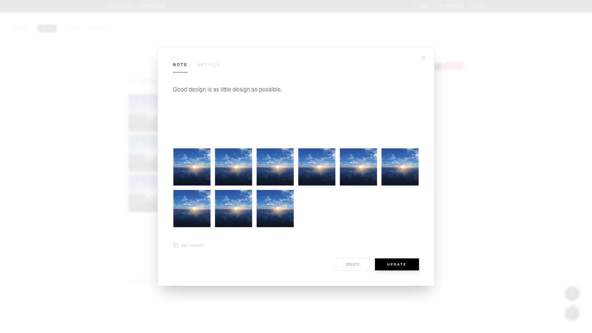
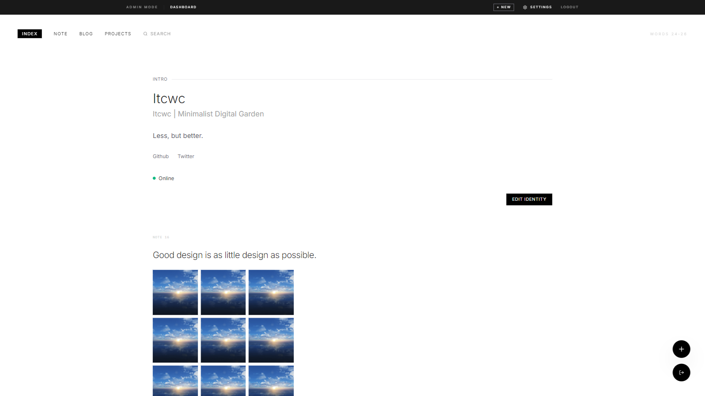

# Digital Garden

A minimalist personal digital garden system for showcasing projects, notes, and blog posts.

**Repository**: [https://github.com/itcwc/itcwc-laravel-blog](https://github.com/itcwc/itcwc-laravel-blog)

**[中文文档](README_CN.md)**

## Screenshots

### Homepage



### Projects



### Blog



### Note



### Admin Panel

#### Blog Management



#### Note Management



#### Project Management


#### Settings



## Requirements

- PHP >= 8.2
- MySQL >= 5.7
- Redis
- Composer

## Installation

### 1. Install Dependencies

```bash
composer install
```

### 2. Configure Environment

Copy `.env.example` to `.env` and modify the configuration:

```bash
cp .env.example .env
```

### 3. Generate Application Key

```bash
php artisan key:generate
```

### 4. Basic Configuration

Edit the `.env` file and ensure the following settings are correct:

```env
# Queue driver must be set to redis
QUEUE_CONNECTION=redis

# Redis connection
REDIS_HOST=127.0.0.1
REDIS_PASSWORD=null
REDIS_PORT=6379
```

### 5. Start Queue Worker

```bash
php artisan queue:work
```

> It is recommended to use Supervisor to keep the queue process running.

### 6. Run Installation Wizard

Visit the following URL to start the installation:

```
http://your-app.test/install
```

The installation wizard will guide you through:
- Environment check
- Database configuration
- Admin account creation
- Language selection

## Development

```bash
# Start development server
php artisan serve

# Watch frontend assets
npm run dev
```

## License

MIT
