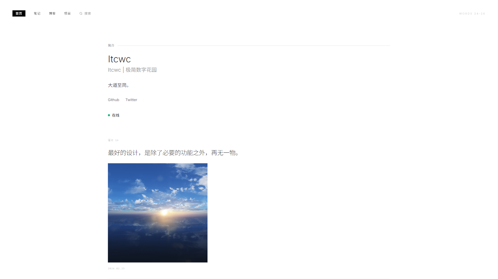
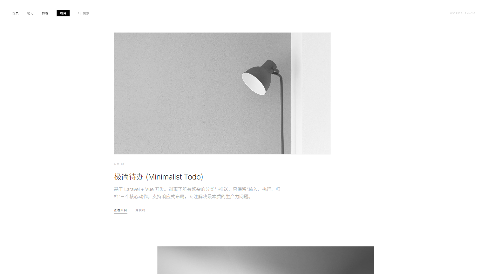
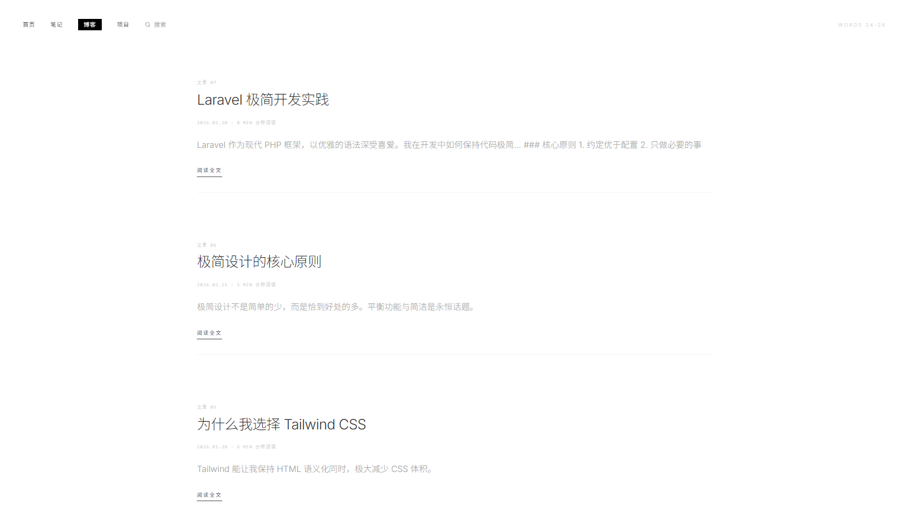
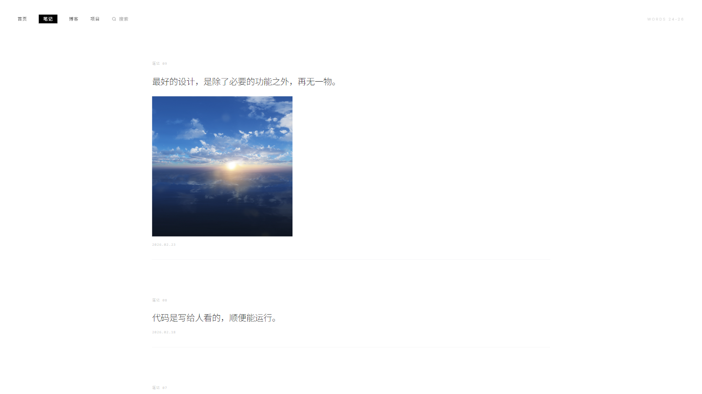
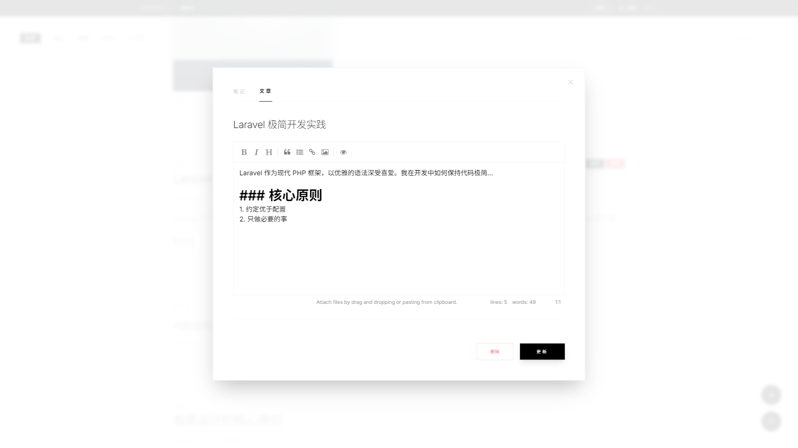
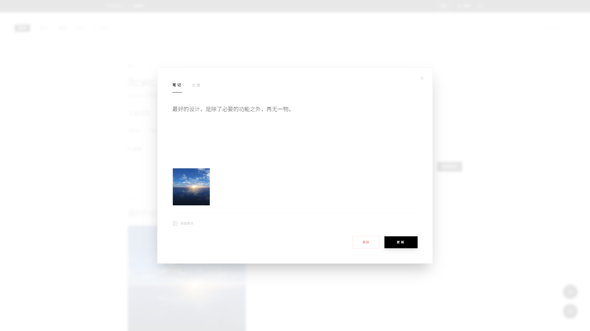
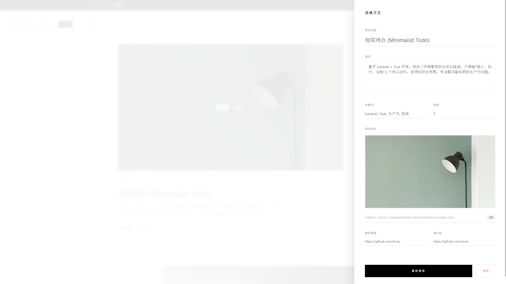
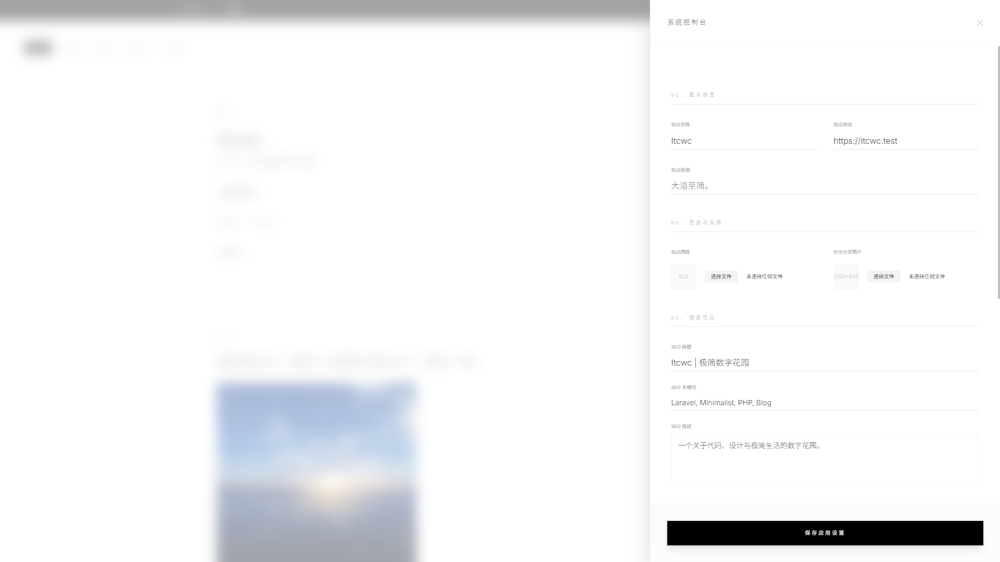

# Digital Garden

一个简洁的个人数字花园系统，用于展示项目、笔记和博客文章。

**仓库地址**: [https://github.com/itcwc/itcwc-laravel-blog](https://github.com/itcwc/itcwc-laravel-blog)

**[English](README.md)**

## 截图预览

### 首页



### 项目展示



### 博客文章



### 笔记



### 管理后台

#### 博客管理



#### 笔记管理



#### 项目管理



#### 系统设置



## 环境要求

- PHP >= 8.2
- MySQL >= 5.7
- Redis
- Composer
- Node.js >= 20.19.0
- npm

## 安装步骤

### 1. 安装项目依赖

```bash
composer install
npm install
```

### 2. 配置环境变量

复制 `.env.example` 为 `.env` 并修改配置：

```bash
cp .env.example .env
```

### 3. 生成应用密钥

```bash
php artisan key:generate
```

### 4. 基础配置

编辑 `.env` 文件，确保以下配置正确：

```env
# 队列驱动必须设置为 redis
QUEUE_CONNECTION=redis

# Redis 连接信息
REDIS_HOST=127.0.0.1
REDIS_PASSWORD=null
REDIS_PORT=6379
```

### 5. 启动队列工作进程

```bash
php artisan queue:work
```

> 建议使用 Supervisor 保持队列进程持续运行。

### 6. 执行安装向导

访问以下地址开始安装：

```
http://your-app.test/install
```

安装向导将引导您完成：
- 环境检测
- 数据库配置
- 管理员账号创建
- 语言选择

## 开发

```bash
# 启动开发服务器
php artisan serve

# 监听前端资源变化
npm run dev
```

## 许可证

MIT
